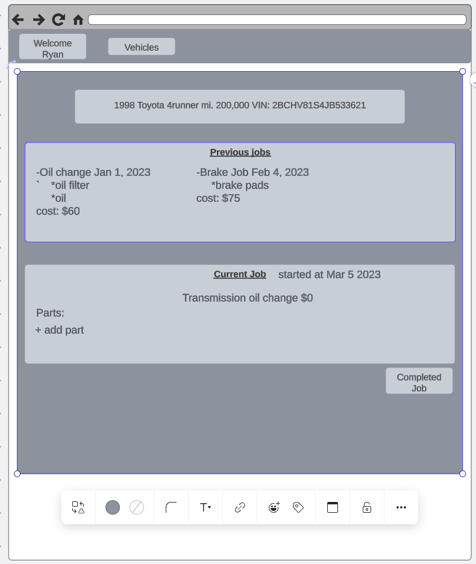

# AutoCare Hub

 Your trusted companion for maintaining your vehicle in peak condition. Say goodbye to the hassle of keeping track of your car's maintenance schedule, service history, and expenses on paper or in scattered spreadsheets.
## User Stories
* As a car owner, I want to be able to add my vehicles to the app, including details like make, model, year, and mileage.

* As a car owner, I want to view a list of all my vehicles in one place, so I can easily keep track of multiple vehicles.

* As a car owner, I want to create, edit, and delete maintenance jobs for each of my vehicles, specifying details like the type of job, date, and cost.

## Wireframes

## ERD

## Routes
### Vehicles
* GET /vehicles: Display a list of all vehicles.
* GET /vehicles/new: Show a form to create a new vehicle.
* POST /vehicles: Create a new vehicle.
* GET /vehicles/:id: Show details of a specific vehicle.
* GET /vehicles/:id/edit: Show a form to edit a specific vehicle.
* PUT /vehicles/:id: Update a specific vehicle.
* DELETE /vehicles/:id: Delete a specific vehicle.
### Maintenance Jobs
* GET /vehicles/:id/jobs: Display a list of maintenance jobs for a specific vehicle.
* GET /vehicles/:id/jobs/new: Show a form to create a new maintenance job for a specific vehicle.
* POST /vehicles/:id/jobs: Create a new maintenance job for a specific vehicle.
* GET /vehicles/:id/jobs/:job_id: Show details of a specific maintenance job for a specific vehicle.
* GET /vehicles/:id/jobs/:job_id/edit: Show a form to edit a specific maintenance job for a specific vehicle.
* PUT /vehicles/:id/jobs/:job_id: Update a specific maintenance job for a specific vehicle.
* DELETE /vehicles/:id/jobs/:job_id: Delete a specific maintenance job for a specific vehicle.

# Technology

* Django
* Postgres
* React

# MPV

## Views
* Add/Edit Job View
* Add/Edit Vehicle View
* Index view

## Features

* User can create and edit vehicles
* User can create and edit jobs associated with the vehicle
* User can view an index view which will show the list of vehicles associated with a user

# Stretch Goals
* Add VIN decoder API to autofill vehicle information
* Add a notification feature to remind user when maintenance is due
* Add a search feature to filter specific jobs done
